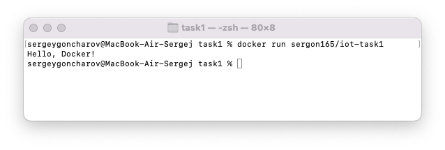

# Задание 1
1. **Docker** и **Docker Desktop** уже были установлены на компьютере.
2. Учетная запись на **Dockerhub** уже имеется (*sergon165*).
3. Выполнена загрузка docker-образа **python:3.12-alpine**.
```commandline
docker pull python:3.12-alpine
```

4. Создан минимальный проект на Python из 1 файла (*main.py*).

*main.py*:
```python
print('Hello, Docker!')
```

5. Создан *Dockerfile*, который копирует *main.py* в контейнер и запускает его.

*Dockerfile*:
```dockerfile
FROM python:3.12-alpine
COPY main.py /
CMD ["python3", "./main.py"]
```

6. Проект упакован в docker-образ.
```commandline
docker build -t sergon165/iot-task1
```

7. Docker-образ запущен.
```commandline
docker run sergon165/iot-task1
```
Результат:


8. Проект выгружен на Dockerhub.
```commandline
docker push sergon165/iot-task1
```