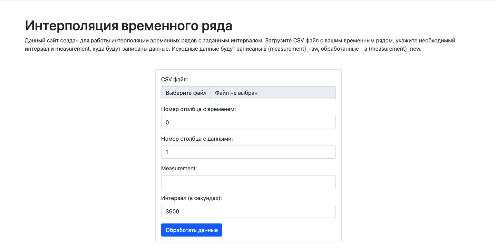

# Задание 1
1. **Docker** и **Docker Desktop** уже были установлены на компьютере.
2. Учетная запись на **Dockerhub** уже имеется (*sergon165*).
3. Выполнена загрузка docker-образа **python:3.12-alpine**.
```commandline
docker pull python:3.12-alpine
```

4. Создан минимальный проект на Python из 1 файла ([*main.py*](task1/main.py)).

*main.py*:
```python
print('Hello, Docker!')
```

5. Создан *Dockerfile*, который копирует *main.py* в контейнер и запускает его.

*Dockerfile*:
```dockerfile
FROM python:3.12-alpine
COPY main.py /
CMD ["python3", "./main.py"]
```

6. Проект упакован в docker-образ.
```commandline
docker build -t sergon165/iot-task1
```

7. Docker-образ запущен.
```commandline
docker run sergon165/iot-task1
```
Результат:


8. Проект выгружен на Dockerhub.
```commandline
docker push sergon165/iot-task1
```

# Задание 2
## Создание *Dockerfile* для InfluxDB
1. Использован docker-образ influxdb:1.8-alpine.
   
```dockerfile
FROM influxdb:1.8-alpine 
```

2. Указана рабочая директория.
```dockerfile
WORKDIR /
```

3. Указана переменная окружения для создания базы данных.
```dockerfile
ENV INFLUXDB_DB=data
```

4. Указан порт 8086.
```dockerfile
EXPOSE 8086
```

5. Задана команда, которая выполняется при старте контейнера.
```dockerfile
CMD ["influxd"]
```

## Сборка и запуск
1. Произведена сборка образа.
```commandline
docker build -t iot-influx .
```

2. Произведен запуск образа с открытием порта.
```commandline
docker run -p 8086:8086 iot-influx
```

## Проверка
1. В проект добавлен *weather.csv* (данные о температуре в Перми за сентябрь).
2. В проект добавлен *function.py*, который:
    1. считывает данные из *weather.csv*,
    2. записывает их в InfluxDB (measurement "raw_data"),
    3. делает интерполяцию с интервалом в 1 час,
    4. записывает полученные данные в InfluxDB (measurement "new_data").
    
3. Запущен *function.py*.

raw_data:


new_data:


Из графиков видно, что программе успешно получилось подключиться к InfluxDB и записать данные.

# Задание 3
1. В *Dockerfile* добавлено создание тома.
```dockerfile
VOLUME ["/var/lib/influxdb"]
```

Теперь при перезапуске контейнера, данные из базы данных не стираются.

2. Получен доступ к InfluxDB через Curl.
```commandline
curl -G http://localhost:8086/query --data-urlencode "q=show databases"
```


# Задание 4
1. В проект добавлено интернет-приложение на Flask, которое представляет из себя веб-страницу в формой и функцию обработки этой формы. Файл приложения: *app.py*.
2. Переписан *function.py* так, чтобы его могло вызывать интернет-приложение и передавать все необходимые данные.
3. Добавлен *Dockerfile* для интернет-приложения.

*app/Dockerfile:*
```dockerfile
FROM python:3.12-alpine

WORKDIR /app

COPY requirements.txt .

RUN python -m pip install --upgrade pip
RUN pip install -r requirements.txt

COPY . .

EXPOSE 5000

CMD ["python", "app.py"]
```   

4. Добавлен *docker-compose.yml*, в котором прописаны 2 сервиса.

*docker-compose.yml:*
```yaml
version: "3.7"

services:
  app:
    build:
      context: app
    ports:
      - 5000:5000
    depends_on:
      - influx

  influx:
    image: influxdb:1.8-alpine
    working_dir: /
    environment:
      INFLUXDB_DB: data
    volumes:
      - influx_data:/var/lib/influxdb
    ports:
      - 8086:8086
    command: influxd

volumes:
  influx_data:
```

5. Запущен docker-compose.
```commandline
docker-compose up -d
```

Сайт:


## Проверка
Проверка производилась на файле *weather.csv* для интервала 3600 секунд (1 час). Сайт работает, данные записываются.

# Задание 5
1. Просканирован образ **project-app** c интернет-приложением. Проблем не обнаружено.
```commandline
docker scan project-app
```


2. *Dockerfile* изначально был хорошо оптизирован, однако для эксперимента попробуем поставить копирование файлов проекта до установки зависимостей.

**Результаты:**

|Копирование файлов|Время 1-й сборки|Время 2-й сборки|
|-|:-:|:-:|
|Перед зависимостями|6:11 мин|6:07 мин|
|После зависимостей|6:09 мин|0:06 мин|


3. Добавлен *.dockerignore*.

```
venv/
Dockerfile
```

**Результат:** ненужные файлы не копируются в образ, тем самым сокращается время сборки образа и его размер. Удалось уменьшить размер образа на 400 МБ.

# Задание 6
